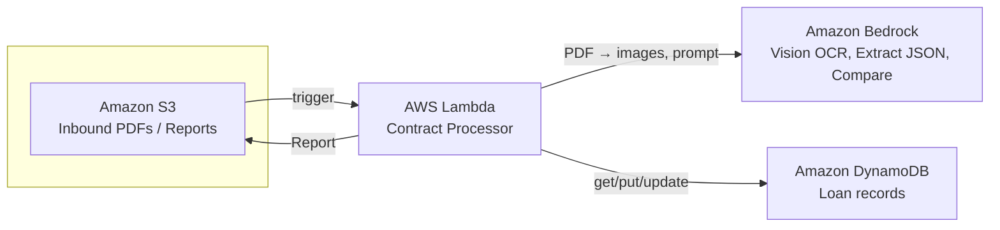

# Contract Processor – Architecture (for PowerPoint)

Use **AWS Architecture Icons**: https://aws.amazon.com/architecture/icons/  
Download the asset package and use the icons listed below.

---

## Updating your diagram (remove Textract)

**Changes to make in your slide:**

1. **Remove** the **Amazon Textract** box and any arrows to/from it.
2. **Keep** these four boxes only: **S3**, **Lambda**, **Bedrock**, **DynamoDB**.
3. **Lambda** labels: keep "Contract Processor". No arrow from Lambda to Textract.
4. **Bedrock** label: change to **"Vision OCR, Extract JSON, Compare"** (Bedrock does OCR + extraction in one step; no Textract).
5. **Arrows:** S3 → Lambda (trigger); Lambda → Bedrock (images + prompts); Lambda → DynamoDB (get/put/update); Lambda → S3 (Report).

**Resulting layout:** S3 → Lambda → Bedrock and DynamoDB (two branches from Lambda); Lambda → S3 for reports.

---

## Mermaid diagram (current architecture)



---

## Flow (left to right)

```
[User]  →  [S3 Bucket]  →  [Lambda]  ──→  [Bedrock]
                ↑              |              |
                |              |   (PDF→images, vision OCR + JSON extraction)
                |              ↓              |
                |         [DynamoDB]  ←───────+  (comparison for duplicates)
                |              |
                +── [S3 Reports] ←── (write report)
```

---

## Components (for PowerPoint)

| # | AWS Service | Icon name in AWS set | Role |
|---|-------------|----------------------|------|
| 1 | **Amazon S3** | Storage – Amazon S3 / S3 bucket | Inbound PDFs; report output |
| 2 | **AWS Lambda** | Compute – AWS Lambda | Orchestrator: read PDF, convert to images (PyMuPDF), call Bedrock (vision + comparison), read/write DynamoDB, write report |
| 3 | **Amazon Bedrock** | Machine Learning – Amazon Bedrock | Vision OCR + structured JSON extraction (Claude); compare extracted vs DB for duplicates |
| 4 | **Amazon DynamoDB** | Database – Amazon DynamoDB / DynamoDB table | Loans table: loan records; Config table: extraction fields per config_id; auto-increment counter |

---

## Layout suggestion (copy into PowerPoint)

**Row 1 – Trigger & storage**
- **Left:** Icon "User" or "Client" (optional).
- **Center:** **S3** (one bucket, three logical areas: `inbound/`, `reports/`, `exceptions/`). Label: "S3 – Inbound PDFs / Reports / Exceptions".

**Row 2 – Processing**
- **Center:** **Lambda**. Label: "Lambda – Contract processor".
- Arrows: S3 → Lambda (trigger), Lambda → S3 (read PDF, write report).

**Row 3 – AWS services Lambda uses**
- **Left:** **Bedrock**. Arrows: Lambda → Bedrock (vision OCR + structured extraction; comparison for duplicates).
- **Right:** **DynamoDB**. Arrows: Lambda → DynamoDB (get/put/update).

**Short caption**
"PDF uploaded to S3 triggers Lambda. Lambda converts the PDF to images (PyMuPDF) and uses Bedrock (Claude vision) for OCR and structured extraction, then DynamoDB for loan data. For duplicate loan numbers, Bedrock compares extracted vs DB. Reports are written back to S3."

---

## Data flow (for bullets in PowerPoint)

1. User uploads PDF to **S3** (`bedrock-demo/inbound/`). Filename must have config prefix (e.g. `sone_RV_Contract.pdf`).
2. **S3** event triggers **Lambda**. Lambda extracts prefix from filename, loads config from DynamoDB. If no prefix or config not found, copies to `exceptions/` and stops.
3. **Lambda** reads PDF from S3 and converts pages to PNG images (PyMuPDF).
4. **Lambda** sends images + prompt to **Bedrock** (Claude vision); receives structured JSON (loan_number, borrower_name, VIN, etc.) in one step.
5. **Lambda** reads/writes **DynamoDB** (lookup by loan_number; insert new or merge duplicate).
6. For duplicates, **Lambda** calls **Bedrock** again to compare extracted vs DB.
7. **Lambda** generates HTML report and uploads it to **S3** (`bedrock-demo/reports/`).
